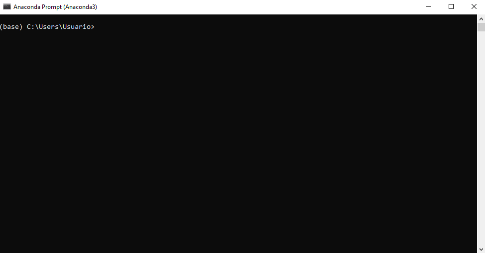

# Instalando Python 

En esta introducción, se explicará cómo instalar Python mediante la
distribución de [Anaconda](https://www.anaconda.com) pensando que puede 
facilitar el uso de Python a usuarios principiantes (no es necesario utilizar
Anaconda para seguir este curso, aunque sí que es recomendable instalar
[Jupyter Notebook](https://jupyter.org/) en caso de que no se opte por
la instalación de Anaconda).

## Descargando e instalando Anaconda

Para descargar [Anaconda](https://www.anaconda.com) haremos click en el
siguiente enlace:

[https://www.anaconda.com/distribution/#download-section](https://www.anaconda.com/distribution/#download-section)

y descargaremos Python 3.

Una vez descargado el archivo ejecutable, lo abrimos y seguimos los pasos
de instalación.

Como se ha comentado antes, Anaconda crea diferentes entornos de trabajo de forma cómoda y de distintos lenguajes de programación, como pueden ser Pyhton (vía Jupiter, Spider o el propio Python) o R (vía RStudio). Su apertura se efectúa desde Anaconda Navigator y su terminal desde Anaconda Promt.

## Instalando los módulos necesarios

Una vez instalado, vamos a instalar los módulos necesarios. Para ello,
podemos crear un entorno virtual de Python (no se explicarán los detalles
de cómo montar y ejecutar los entornos virtuales) o instalar los módulos
directamente sin crear ningún entorno virtual.

Para ello, abriremos `Anaconda Prompt`:



Una vez abierto, nos colocaremos en la dirección que hemos descargado
el repositorio:

```bash
$ cd C:\path_to_repository\prevision-dia-tiempo-real
```

y una vez allí ejecutamos lo siguiente:

```bash
$ pip install -r requirements.txt
```

 >- Nota: de esta forma se instalarán los módulos en la base de Python, aunque lo recomendable
> sería instalarlo en un entorno virtual. Aún así en este curso no se va a detallar en la instalación
> de entornos virtuales en Python

Este proceso puede tardar varios minutos, pero a partir de entonces ya se habrán instalado todos
los módulos de Python necesarios para los siguientes ejercicios.

# Instalando R dentro de Jupiter (contenido en Anaconda)

Jupiter nos permite abrir notebooks de lenguaje Python. Ahora le añadiremos la funcionalidad de apertura de notebooks de lenguaje R.

Jupiter es una herramienta muy interesante ya que permite trabajar mediante celdas, agilizando y dinamizando la tarea de desarrollo de modelos. Además permite insertar texto en formato Markdown, pudiendo poner estructura y comentarios con estilo para organizar o resaltar resultados en el código y a la vez crear informes. Debido a esta flexibilidad, es muy usado a nivel profesional en Data Science.

Para añadir el uso de R a Jupiter, se ejecuta nuevamente en Anaconda Prompt:

```bash
$ conda install -c r r-essentials
```

 >- Nota: Puede ser también necesario, ejecutar después:
 
```bash
$ install.packages(c(repr, IRdisplay, evaluate, crayon, pbdZMQ, devtools, uuid, digest), type=source)
$ devtools::install_github(IRkernel/IRkernel)
$ IRkernel::installspec(user=FALSE)
```

> Si hubiera complicaciones, seguir este [enlace](https://medium.com/@pabecer/instalar-el-kernel-de-r-en-jupyter-notebook-38bc724cc0d7)


