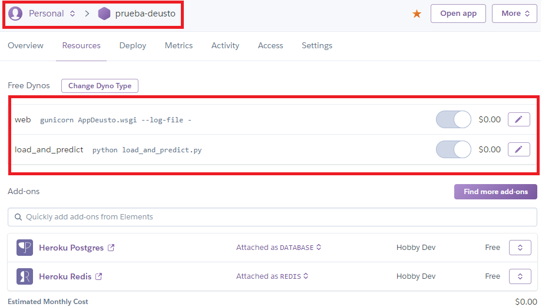
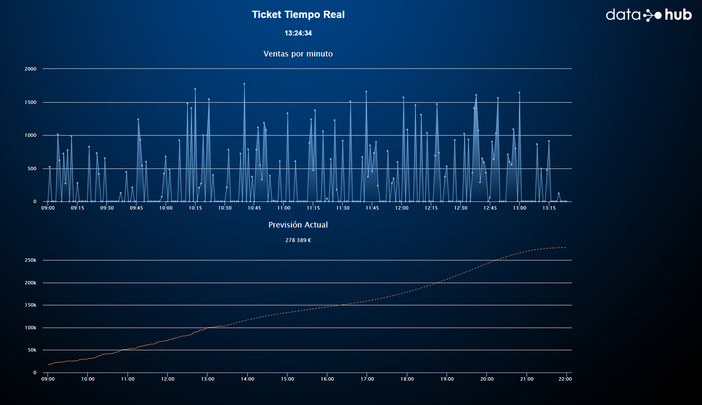

# Creando nuestra App en Tiempo Real

En esta última sección se ha generado un código base para poder visualizar los datos 
generados en las fases previas del curso. Para ello, se ha recurrido al módulo de
[Django](https://www.djangoproject.com/), un paquete que se integra de forma muy
fácil en [Heroku](https://www.heroku.com/) y nos permite así crear un servidor
en la nube.

A continuación vamos a explicar brevemente los siguientes puntos:

1. [Estructura de la App](#estructura-de-la-app)
     1. [Carga de datos de PubSub](#carga-de-datos-de-pubsub)
     1. [Predicción](#prediccin)
     1. [Visualizacióon de los datos mediante Django](#visualizacin-de-los-datos-mediante-django)
1. [Preparando la App para subir a Heroku](#preparando-la-app-para-subir-a-heroku)
1. [Cómo subir la App a Heroku](#cmo-subir-la-app-a-heroku)

## Estructura de la App

La app se compone de 3 bloques principales:

 - [Carga de datos de PubSub](#carga-de-datos-de-pubsub)
 - [Predicción](#prediccin)
 - [Visualización de los datos mediante Django](#visualizacin-de-los-datos-mediante-django)

Cada bloque se va a montar de forma independiente en [Heroku](https://www.heroku.com/),
(en 3 servidores diferentes) tal y como especificamos en el archivo `Procfile`

```bash
load_and_prediction: python load_and_prediction.py
web: gunicorn AppDeusto.wsgi --log-file -
```

### Carga de datos de PubSub y Predicción

Esta parte está escrita en el script `load_and_prediction.py`. Mediante ese código
vamos a estar escuchando constantemente los datos que vayan entrando en nuestra
suscripción de PubSub, de forma que iremos recibiendo los tickets que se vayan 
generando en tiempo real.

Al mismo tiempo se aplica
el modelo predictivo que se ha generado en la parte previa del curso a los datos
que se vayan recibiendo en tiempo real.

Los resultados obtenidos se guardan en la base de datos de [Heroku Redis](https://devcenter.heroku.com/articles/heroku-redis)
que se ha generado anteriormente.

### Visualización de los datos mediante Django

Para esta parte, se ha creado un código base para mostrar los datos mediante 
gráficos de [Highcharts](https://www.highcharts.com/). Para ello, se han creado varios
archivos HTML-CSS-JavaScript sencillos y las gráficas de [Highcharts](https://www.highcharts.com/)
se han alimentado con los datos previamente guardados en [Heroku Redis](https://devcenter.heroku.com/articles/heroku-redis).

## Preparando la App para subir a Heroku

Tendremos que realizar los siguientes cambios para que nuestra App funcione 
correctamente:

### Copiar las credenciales

Vamos a copiar las credenciales generadas en `2. Creando la cuenta de Google Cloud`
y vamos a pegarlos en la carpeta `credenciales` con el nombre `credentials.json`:

```
AppDeusto/
    AppDeusto
    home
    no_django/
        calendario
        credenciales/
            credentials.json
        forma_serie_temporal
```

Esas credenciales se leerán en el script `load_data_from_pubsub.py` para poder
acceder a los datos de PubSub.

### Especificar la Id del proyecto y de la suscripción

De la misma forma que en el apartado anterior, tendremos que especificar la Id
del proyecto y de la suscripción para poder leer los datos de PubSub. Para ello,
debemos modificar `load_data_from_pubsub.py` en la parte del `TODO`:

```python
# TODO: insertar la 'id' del proyecto y la 'id' de las suscripción PubSub
project_id = ''
subscription_id = ''
subscription = client.subscription_path(project_id, subscription_id)
```

### Copiar los modelos

Vamos a copiar los modelos generados en `1. Creando el modelo predictivo` y 
vamos a pegarlos en la carpeta `no_django`:

```
AppDeusto/
    AppDeusto
    home
    no_django/
        calendario
        credenciales
        forma_serie_temporal
        modelos/
            max_value.txt
            modelo_1000.sav
            modelo_1100.sav
            modelo_1200.sav
            modelo_1300.sav
            modelo_1400.sav
            modelo_1500.sav
            modelo_1600.sav
            modelo_1700.sav
            modelo_1800.sav
            modelo_1900.sav
            modelo_2000.sav
            modelo_2100.sav
            modelo_2200.sav
            modelo_2300.sav
```

Esos modelos se leerán en el script `prediction.py` en la parte donde se
cargan los modelos:

```python
# Load model
# TODO: se pueden cambiar los modelos para hacer diferentes pruebas
loaded_model = joblib.load('no_django/modelos/modelo_{}00.sav'.format(str(hour)))
```

y donde se lee el valor máximo utilizado en el cálculo del modelo:

```python
# TODO: especificar las ventas máximas del histórico
file = open('modelos/max_value.txt', 'r')
for line in file:
    max_value = float(line)
file.close()
```

## Cómo subir la App a Heroku

Una vez hemos preparado la App, ya estamos preparados para subirlo a 
[Heroku](https://www.heroku.com/). Para empezar, vamos a confirmar que hemos instalado
[Heroku CLI](https://devcenter.heroku.com/articles/heroku-cli) en nuestro ordenador,
para ello ejecutaremos lo siguiente en nuestra terminal:

```bash
$ heroku --version

heroku/7.33.3 win32-x64 node-v11.14.0
```

Lo siguiente que haremos será registrarnos con nuestra cuenta:

```
$ heroku login

heroku: Press any key to open up the browser to login or q to exit:
Opening browser to https://cli-auth.heroku.com/auth/browser/79f02826-d347-4f92-8e92-e722949e02fd
Logging in... done
Logged in as presentacion.deusto.universidad@gmail.com
```

Para confirmar que estamos registrados podemos ver nuestras Apps:

```
$ heroku apps

=== presentacion.deusto.universidad@gmail.com Apps
presentacion-deusto
```

Una vez confirmado, vamos a dirigirnos a la dirección la siguiente dirección:

```bash
$ cd C:\path_to_repository\prevision-dia-tiempo-real\4. Subiendo la App a Heroku\AppDeusto

C:\path_to_repository\prevision-dia-tiempo-real\4. Subiendo la App a Heroku\AppDeusto
```

Comprobamos que hemos instalado correctamente `.git`

```bash
$ git --version

git version 2.20.1.windows.1
```

Iniciamos `.git`:

```bash
$ git init

Initialized empty Git repository in
C:/path_to_repository/prevision-dia-tiempo-real/4. Subiendo la App a Heroku/AppDeusto/.git/
```

continuamos añadiendo todos nuestros archivos mediante `.git`:

```bash
$ git add .

warning: LF will be replaced by CRLF in no_django/credenciales/credentials.json.
The file will have its original line endings in your working directory
```

y vamos a guardar la versión que hemos creado mediante

```bash
$ git commit -m "Preparar App para subirlo a Heroku"
```

apuntamos a nuestra app (tendremos que cambiar el nombre de `presentacion-deusto`)

```bash
$ heroku git:remote -a presentacion-deusto
```

especificamos la franja horaria para la App

```bash
$ heroku config:add TZ="Europe/Madrid"
```

y lanzamos nuestra app a Heroku. Este proceso puede tardar varios minutos

```bash
$ git push heroku master

Enumerating objects: 114, done.
Counting objects: 100% (114/114), done.
Delta compression using up to 4 threads
Compressing objects: 100% (94/94), done.
Writing objects: 100% (114/114), 470.27 KiB | 3.85 MiB/s, done.
Total 114 (delta 27), reused 0 (delta 0)
remote: Compressing source files... done.
remote: Building source:
remote:
remote: -----> Python app detected
remote: -----> Installing python-3.7.5
remote: -----> Installing pip
remote: -----> Installing dependencies with Pipenv 2018.5.18…
remote:        Installing dependencies from Pipfile.lock (7b4028)…
remote: -----> Installing SQLite3
remote: -----> $ python manage.py collectstatic --noinput
remote:        126 static files copied to '/tmp/build_e75247fcd4e73dc113efcc7a41148dd8/staticfiles', 394 post-processed.
remote:
remote: -----> Discovering process types
remote:        Procfile declares types -> web
remote:
remote: -----> Compressing...
remote:        Done: 148.4M
remote: -----> Launching...
remote:        Released v6
remote:        https://presentacion-deusto.herokuapp.com/ deployed to Heroku
remote:
remote: Verifying deploy... done.
To https://git.heroku.com/presentacion-deusto.git
 * [new branch]      master -> master
```

Si todo ha funcionado correctamente, deberíamos estar viendo nuestra app en funcionamiento
accediendo a la url que nos muestra nuestra terminal:

```bash
remote:        Released v6
remote:        https://presentacion-deusto.herokuapp.com/ deployed to Heroku
```
Finalmente, conviene recargar la página web de Heroku y además activar los procesos, llegando a visualizar la siguiente situación:



y el resultado acabará siendo:

Finalmente, conviene recargar la página web de Heroku y además activar los procesos, llegando a visualizar la siguiente situación:


