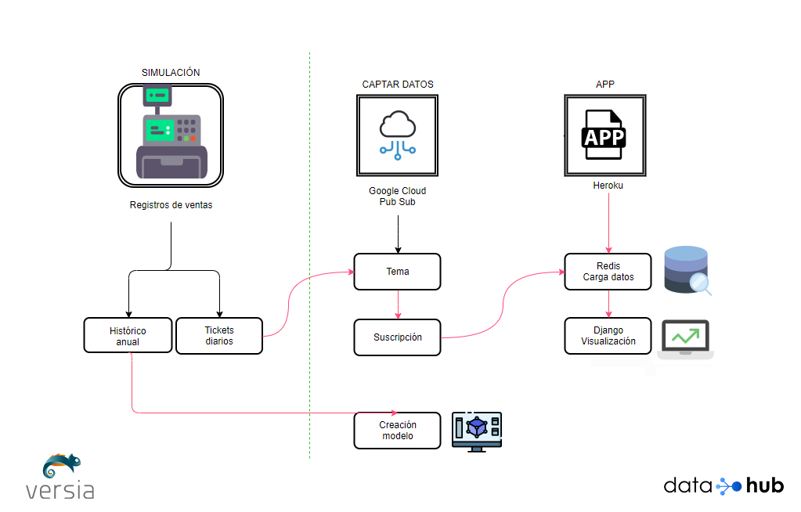

# prevision-dia-tiempo-real
Cálculo de la previsión de ventas en el día utilizando el stream de datos recibido por los puntos de venta (POS - por sus sigla en inglés).

1. [¿Qué resuelve este código?](#qu-resuelve-este-cdigo)
1. [¿A quién va dirigido este código?](#a-quin-va-dirigido-este-cdigo)
1. [Prerequisitos](#prerequisitos)
1. [Instalar R y RStudio para Fake Data](#fake-data)
1. [Crear una cuenta gratuita en Heroku.com](#crer-una-cuenta-gratuita-en-herokucom)
1. [Instalar Heroku](#instalar-heroku)
1. [Instalar git en tu ordenador](#instalar-git-en-tu-ordenador)
1. [Cómo seguir el curso](#cmo-seguir-el-curso)


# ¿Qué resuelve este código?

Mediante el uso de una regresión aplicada a los datos históricos de ventas y al stream de datos recibidos en tiempo real por las Terminales Punto de Venta (TPV o POS - por sus siglas en inglés) se obtiene una previsión de las ventas diarias y se compara con la previsión de ventas estimadas en el plan de negocio.


# ¿A quién va dirigido este código?

A todo el mundo que desea compartir conocimiento.

A cualquier persona interesada en la mejora cuantitativa de las cadenas de suministro.

A cualquier persona interesada en aplicar técnicas de análisis de datos en tiempo real.

# Prerequisitos

Para la utilización de este código es necesario utilizar un conjunto de herramientas cuyo coste económico es cero €. 

## Instalar R y RStudio para Fake Data y Python para crear modelos y su gestión

Los datos utilizados en este proyecto son Fake. Para ello utilizamos el lenguaje R y un IDE (entorno integrado de desarrollo) muy utilizado, RStudio. En orden y respectivamente, se instalan a partir de los siguientes enlaces:

  -R proyect:  https://cloud.r-project.org/
  
  -RStudio Desktop free: https://rstudio.com/products/rstudio/download/

 Una vez instalados, usaremos únicamente RStudio cuya interfaz es más amigable que la del propio R.

Alternativamente y habiendo instalado R proyect, se puede desde Anaconda (https://www.anaconda.com/distribution/) usar
 Jupiter para ejecutar los notebooks de R (__recomendado__). Anaconda reune múltiples entornos de trabajo y de distintos lenguajes. Además, por su sencillez y configuraciones, posee gran relevancia a nivel profesional. 
 
La ventaja de esta opción reside en que está conectado con Pycharm y GitHub. Más adelante, se expondrán los detalles de los pasos a seguir para instalar Phyton y Anaconda e integrar en Jupiter el notebook de R.

## Crear una cuenta gratuita en Heroku.com

Esta plataforma nos permite ejecutar el código generado en la nube sin coste:

1. Creación de una cuenta gratuita en Heroku.com:

  ```bash
  en tu navegador preferido:
  https://signup.heroku.com/login
  ```
  
## Instalar Heroku

 ```bash
https://devcenter.heroku.com/articles/heroku-cli
   ```  

Una vez instalado, para comprobar que esté todo correcto, abrir una terminal e insertar:

  ```bash
  $  heroku --version
  heroku/7.35.0 win32-x64 node-v12.13.0
  ```

En caso de error, hay que modificar la dirección donde apunta. Para ello proceder como sigue:


## Instalar git en tu ordenador

Git es la herramienta que permitirá que el código que modifiques en tu ordenador se pueda "subir" a la nube de Heroku. Git aporta muchas más cosas pero queda fuera del objeto de esta guía detallar Git. Si estás interesado te recomendamos este libro: [Gitbook](https://git-scm.com/book/es/v2)

0. Antes de instalar Git en tu ordenador, [Crea una cuenta gratuita en Github](https://github.com/)

1. [Instalando Git en tu ordenador](https://git-scm.com/book/es/v1/Empezando-Instalando-Git)

2. Si tu ordenador es un Mac, te recomendamos que utilices la opción de [Brew.](https://brew.sh/index_es)

## Cómo seguir el curso

Este curso se divide en 5 bloques:

###### 0.</li> Pasos previos

###### 1.</li> Creando el modelo predictivo

###### 2.</li> Creando la cuenta de Google Cloud

###### 3.</li> Creando la cuenta de Heroku

###### 4.</li> Subiendo la App a Heroku

Se recomienda seguir los 5 bloques en el orden indicado, aunque para el usuario
que conozca cómo crear cuentas en Google Cloud y/o en Heroku puede saltarse los
pasos 2 y 3 respectivamente.

## Diagrama general del curso



